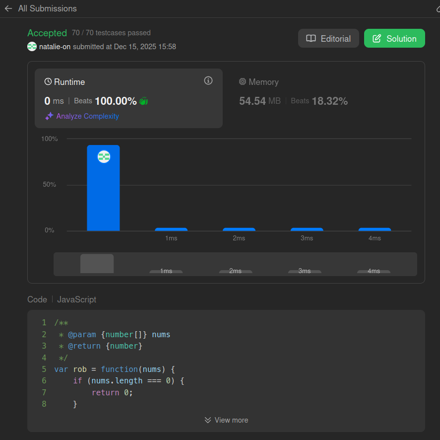

## Submit result on Leetcode

## Method:
- Uses an iterative dynamic programming approach with O(1) space complexity, tracking only the two most recent optimal totals (prev1 and prev2) instead of a full array.

- For each number, it updates the running maximum by choosing the larger value between the previous maximum and the current number added to the maximum from two steps back.