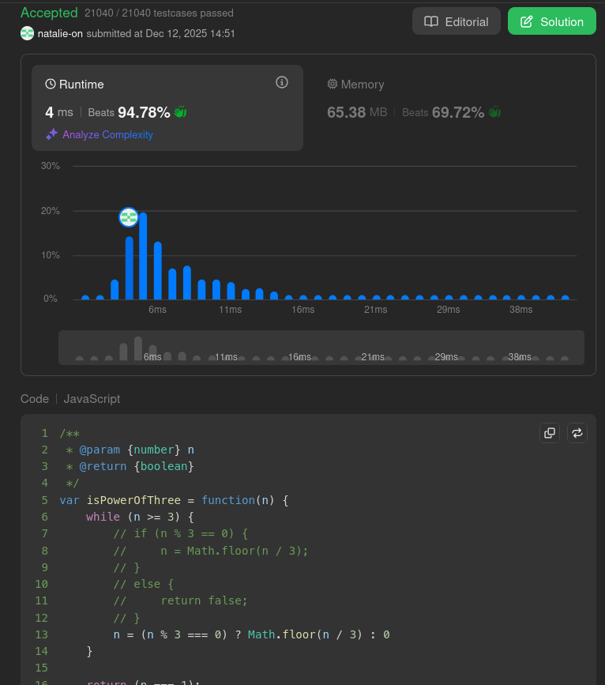

## Submit result on Leetcode

## Method:
- Checks if `n` is a power of three by iteratively dividing by `3`.

- If `n` is divisible, it continues reducing; otherwise, it sets `n` to `0` to stop.

- Returns true only if `n` successfully reduces to `1`.