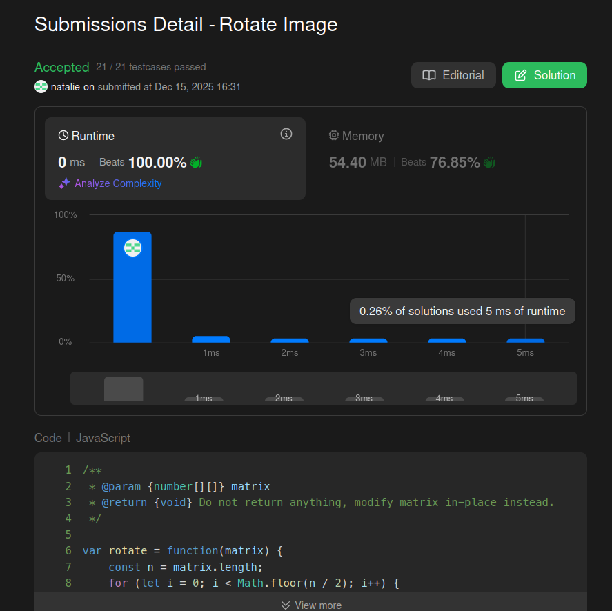

## Submit result on Leetcode

## Method:
1. Save top-left in temp.
2. Move bottom-left to top-left.
3. Move bottom-right to bottom-left.
4. Move top-right to bottom-right.
5. Move temp (top-left) to top-right.
