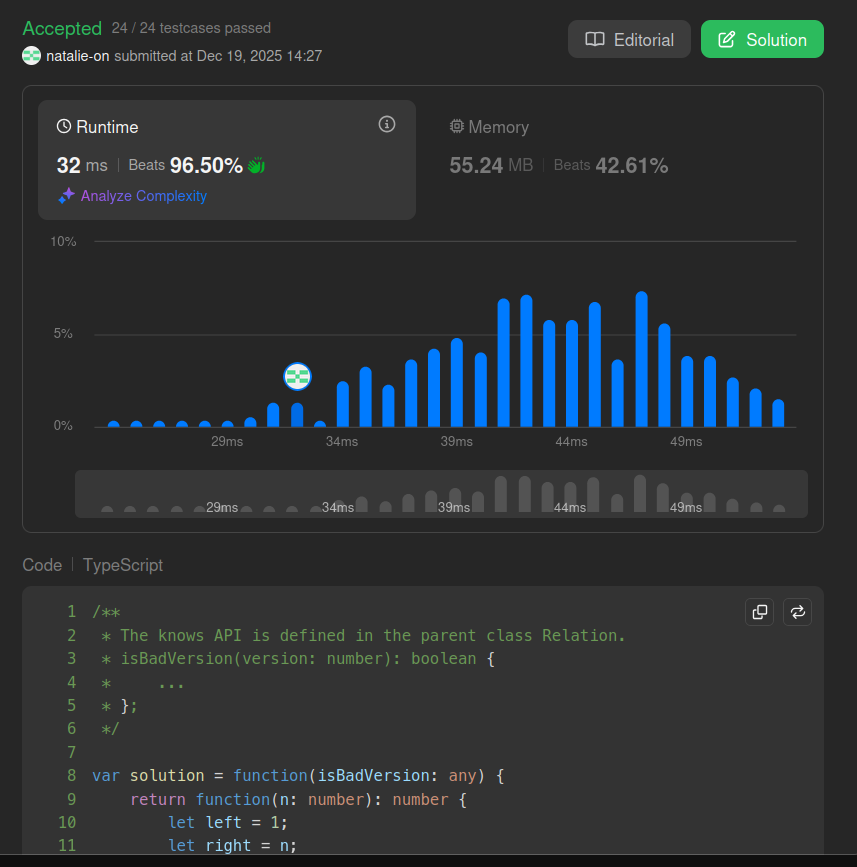

## Submit result on Leetcode

## Method
- Implements a binary search strategy to efficiently locate the earliest bad version while minimizing calls to the check API.
- By halving the search space in each iteration, it achieves `O(log n)` time complexity and avoids linear search overhead.