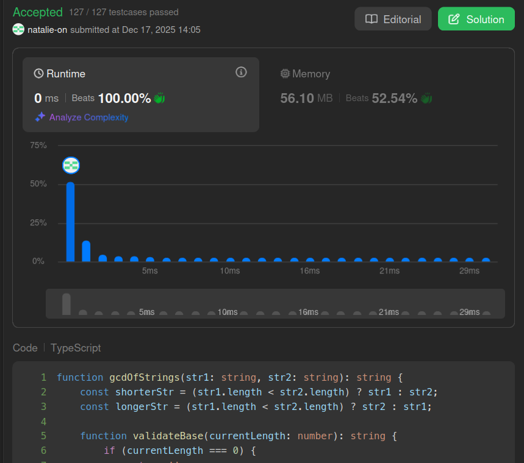

## Submit result on Leetcode

## Method
- Computes the **greatest common divisor** of two strings by recursively testing prefixes of the shorter string in descending order of length. 
- It optimizes performance by strictly skipping lengths that do not mathematically divide both string lengths before validating the substring. 
- A `candidate` is returned as the result only if it can successfully reconstruct both the shorter and longer strings through repetition.