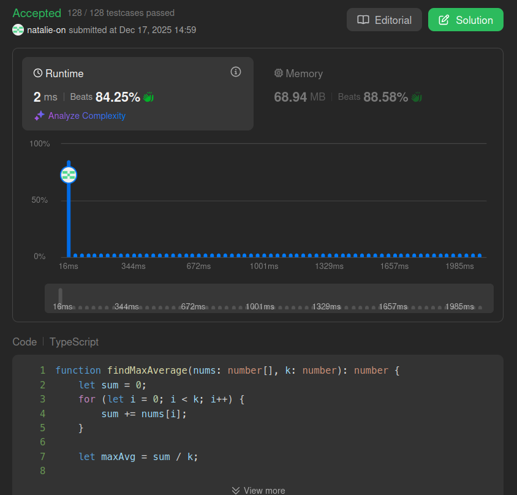

## Submit result on Leetcode

## Method
- Calculates the maximum average of a contiguous subarray of length `k` by maintaining a sliding window sum.
- It iterates once, updating the sum by subtracting the outgoing element and adding the incoming one, achieving `O(N)` time complexity.