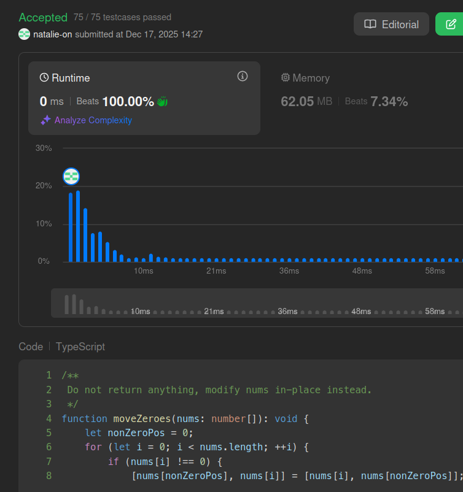

## Submit result on Leetcode

## Method
- Iterates through the array using a two-pointer technique to swap each non-zero element with the position of the first available zero.
- This in-place operation consolidates non-zeros at the start while maintaining their relative order in a single pass.